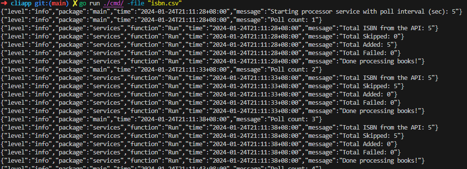

### XYZ Books - CLI app



This CLI application performs the following:

1. Runs indefinitely until it's terminated or has reached the maximum number of errors.
2. Retrieves the ISBN 13 values from the CSV file
3. Fetches books from the API
4. Converts ISBN 13 to ISBN 10 if a book has no ISBN 10
5. Updates the book with the ISBN 10 value
6. Writes new ISBN 13 values to the CSV file

Note: Since the API has ISBN 13 as its primary identifier in the UI (i.e., /books/9781891830853), it's a required field, so there's always an ISBN 13 value for each book.

#### Getting started

1. Create a CSV file. If you want to enter existing ISBN 13 values, put in the first column without separators (.e.g., hyphen) like so:

   ```
   9781891830853
   9781603094542
   ```

2. Run the CLI: `go run ./cmd/ -file "isbn.csv"`
   - The -file flag accepts the path to the CSV file.

#### Configuration

- Modify .env if you want to change the polling interval (POLL_INTERVAL_SECS), maximum number of errors before the program terminates (ERROR_LIMIT), and the API URL where the books will be fetched from (API_SERVER_URL).
- Run `source .env` before running the CLI app to load the environment variables.
