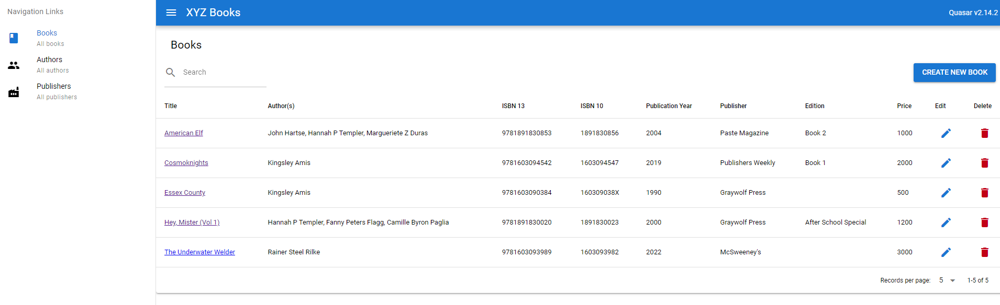

### XYZ Books - Web app


This is a web application that provides CRUD operations for books, authors, and publishers.

It uses the following technologies/tools:

- Go for the backend
- Quasar/Vue 3 for the frontend
- PostgreSQL for the database
- Swaggo for the API documentation
- Golang-migrate for database migrations

## Getting started

### Prerequisites

Your machine must have Docker and Docker Compose installed.

### Running the app

1. Run `docker-compose up`

   You will know that the app is ready when you see the following lines in the logs. This means the server is ready to accept requests and the UI detected that the server is ready.

   ```
    webapp-server   | {"level":"debug","package":"main","time":"2024-01-24T12:18:03Z","message":"Listening on :9001"}
    webapp-ui       | 2024/01/24 12:18:05 Received 200 from http://server:9001/ready
   ```

2. Open http://localhost:8080 to access the UI.
3. Open http://localhost:9001/swagger/index.html to access the API documentation.
4. Open http://localhost:9001/api/books to access the API (Books endpoint). Follow the API documentation for more details.

### Building the app

1. API Documentation

   - If you need to regenerate the API documentation:
     - Install [swag](https://github.com/swaggo/swag)
     - Run: `swag init -g ./internal/router/router.go`

2. UI SPA

   - If you need to run it locally:
     - Install [Quasar](https://quasar.dev/)

3. Backend

   - If you need to run it locally:
     - Install [Go](https://golang.org/)

4. Database and migration

   - You can modify the specific PostgreSQL version in the docker-compose.yml file.
     If you have new migration files, follow the naming convention of the existing files, and just run the migrate service again by running `docker-compose run migrate`

   - Alternatively, your migration will be automatically run when you run the app using `docker-compose up`.

5. Building the app
   - If you made changes to the code and want to rerun the app with updates images, run `docker-compose up --build --force-recreate --remove-orphans`

### Configuration

- Any changes to the `.env` file will be picked up by docker-compose when you run the app. But if you need to run the app locally, you may use `.development.env` then load it into your environment via `source .development.env`. This way, you segregate your local environment variables from the ones used by docker-compose.

### More information

- To reload the database with initial dataset (i.e., start from scratch), run `docker-compose run -e MIGRATE_COMMAND=down migrate` then `docker-compose run -e MIGRATE_COMMAND=up migrate`. This will drop all tables and re-run all migrations. Alternatively, you can bring down the app using `docker-compose down -v` then bring it up again using `docker-compose up --force-recreate --remove-orphans`. This will delete the database volume and create a new one.
